# Welcome to Brain Ring Quiz game
Are you ready to engage your mind, test your knowledge, and embark on an exhilarating journey of intellect? Look no further! [Brain Ring](https://feruzashokirjonovna.github.io/quiz-app/) website is here to challenge your wits and expand your horizons in a quiz game like no other.

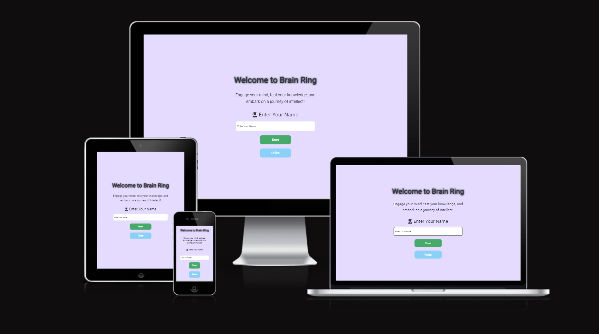

## Table of Contents

- [UX](#ux "UX")
  - [User Goals](#user-goals "User Goals")
  - [Site Owners Goals](#site-owners-goals)
  - [User Requirements and Expectations](#user-requirements-and-expectations)
    - [Requirements](#requirements)
    - [Expectations](#expectations)
    - [Wireframes](#wireframes)
  - [Design Choices](#design-choices)
    - [Fonts](#fonts)
    - [Icons](#icons)
    - [Colors](#colors)
    - [Structure](#structure)
- [Features](#features)
  - [Existing Features](#existing-features)
    - [Welcome Page](#welcome-page)
    - [Game Page](#game-page)
    - [Results Page](#results-page)
    - [Footer](#footer)
    - [Features to be implemented](#features-to-be-implemented)
- [Technologies used](#technologies-used)
  - [Languages](#languages)
  - [Tools](#tools)
- [Testing](#testing)
  - [Functionality Tests](#functionality-tests)
  - [Error Handling Tests](#error-handling-tests)
  - [Responsive Design Tests](#responsive-design-tests)
  - [Performance Tests](#performance-tests)
  - [General Tests](#general-tests)
  - [Bugs](#bugs)
  - [Fixed Bugs](#fixed-bugs)
  - [Unfixed Bugs](#unfixed-bugs)
- [Deployment](#deployment)
- [Credits](#credits)

## UX

### User Requirements and Expectations
- The visitors wish to see readable texts to be able to concentrate on the game.
- The visitors wish to have clear instructions to be able to start the game. They expect to see clear navigations and be able to use all the possible gadgets for this game. The letters should be easy to read and the game should show a clear sign of how many questions there are as well as keep a score for the right and wrong answers.

### User Goals
- Test and improve knowledge:
  - Users may aim to test their current knowledge on various topics.
  - Users may want to improve their understanding of specific areas within the science.
- Compete and Challange:
  - Users might seek the thrill of competition and challenge, trying to achieve high scores or compete against others.
  - Users might want to share their quiz results on social media or challenge their friends to beat their scores.
- Learn in an Engaging Way:
  - Users could be looking for an engaging and interactive way to learn.
- Enjoy a Relaxing Break
  - Some users may use the quiz as a way to take a break and unwind.

[Back to Top](#table-of-contents)

### Site owners Goals
- To create a quiz that covers a wide variety of subjects.
- Increase User Engagement
  - Increase the average time users spend on the platform.
- Boost User Retention:
  - Encourage users to return to the platform regularly.
- Enhance Content Quality:
  - Provide high-quality and diverse quiz content to keep users engaged.

[Back to Top](#table-of-contents)

### Requirements
- User Authentication:
  - Users are asked to insert a username.
- Quiz Creation:
  - The system should allow administrators to create quizzes with multiple-choice questions.
- Mobile Responsiveness:
  - The platform should be accessible and user-friendly on various devices, including desktop and mobile.
- Performance:
  - The system should respond to user interactions quickly, with minimal latency.
- Compatibility:
  - The platform should be compatible with major web browsers to accommodate a wide range of users.

[Back to Top](#table-of-contents)

### Expectations

- Platform Accessibility:
  - Users expect the platform to be accessible on various devices, ensuring a consistent and user-friendly experience, whether on desktop or mobile.
- Engaging Quiz Content:
  - Users look forward to diverse and high-quality quiz content, covering a range of topics.
- Immediate Feedback:
  - Users anticipate immediate feedback on quiz questions, with clear explanations for correct and incorrect answers, enhancing the learning experience.
- Intuitive User Interface:
  - Users anticipate a user-friendly and visually appealing interface that is easy to navigate, contributing to an enjoyable overall experience.

### Wireframes

Wireframes were created using [Balsamic](https://balsamiq.com/wireframes/ "Balsamic") for visual structuring and layout planning, maintaining design consistency across devices.

Desktop View:

Tablet View:

[Back to Top](#table-of-contents)

## Design Choices

### Fonts
I've integrated [Google Fonts](https://fonts.google.com/ "Google Fonts") to find a typeface that complements the website's aesthetic. For the main text, I've opted for 'Roboto'.

### Icons

As for icons I decided to use for my website [Font Awesome library](https://fontawesome.com/ "Font Awesome").
 
### Colors

- #e5dbff- violet : for background of Home page;
- #fff - white: for name input, Rules background, Result text;
- #e7f5ff - blue: for Quiz background;
- red and green : for showing correct and wrong answer options, also for score indicator (#06da8c-green; #f03e3e-red);  
- #19523d - dark blue: for quiz box border, header and footer borders;
- #cccccc - grey: for background of score indicators;
- #1c7ed6 - light blue: for next button in quiz;

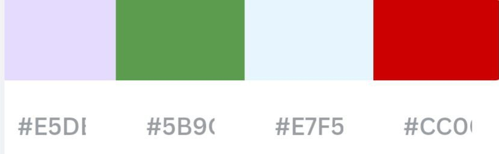

### Structure

The website will follow a mobile-first strategy, the main target is to create a visually appealing design for smaller screens. As for the smallest design I chose Samsung Galaxy S8 and iPhone x.

[Back to Top](#table-of-contents)

## Existing Features

### Welcome Page

- The welcome page serves as an introduction to the game, providing essential details about the rules and mechanics. 
- Rules can be seen by pressing the Rules button.
- The user enters a username. In case the user presses the start button before entering the username, there is a pop-up alert message "Please enter your name".

 Mobile View:

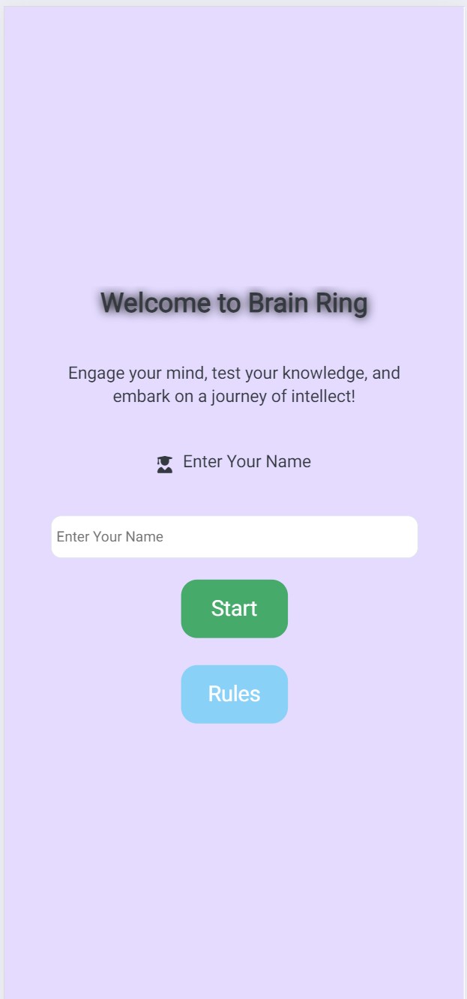

Tablet View:

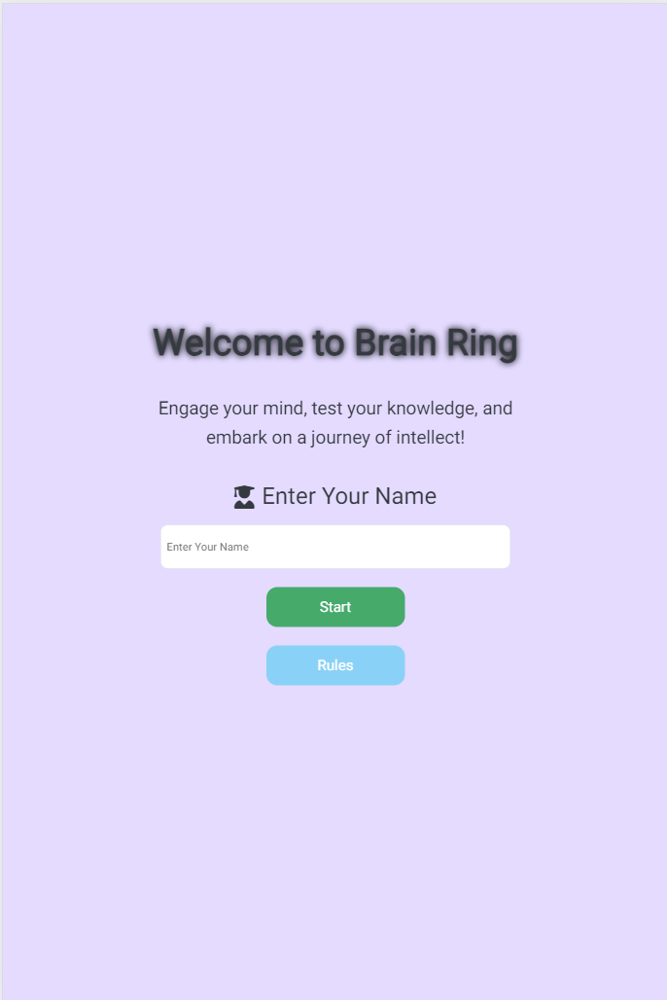

Desktop View:

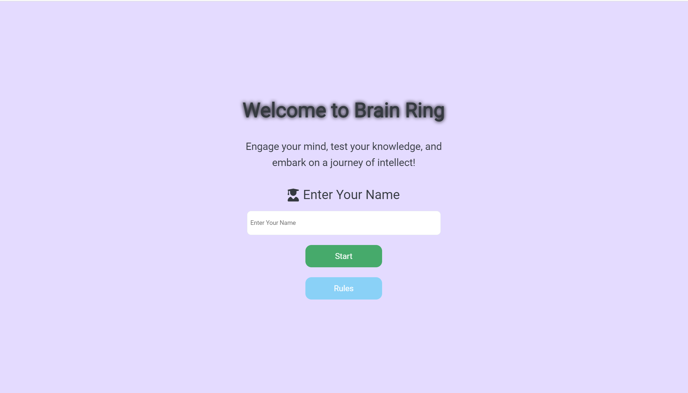

Rules Info:

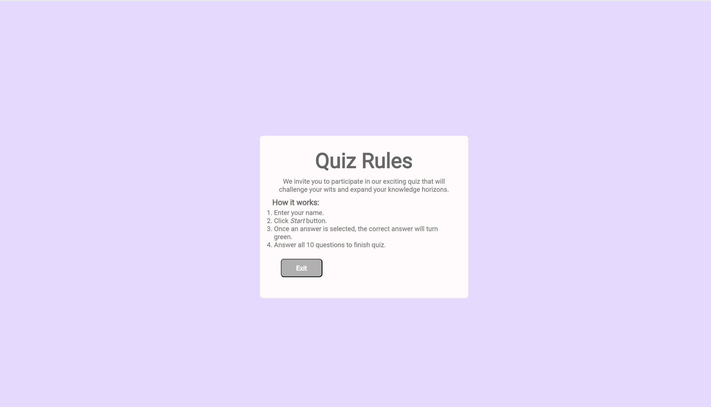

Invalid name input alert message:

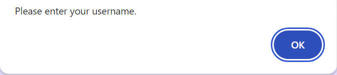

### Game Page

- The game page offers an engaging quiz experience, presenting a series of questions. Users are challenged to answer each question correctly.
- The interface is designed for intuitive navigation, with interactive elements for selecting answers.
- Visual feedback, such as highlighting correct and incorrect choices and score indicator, enhances the gaming experience.
- Score Indicator style varies due to screen sizes.
- If the user ttries to skip the question without choosing any option, a pop-up alert message will be displayed. 

Mobile View:

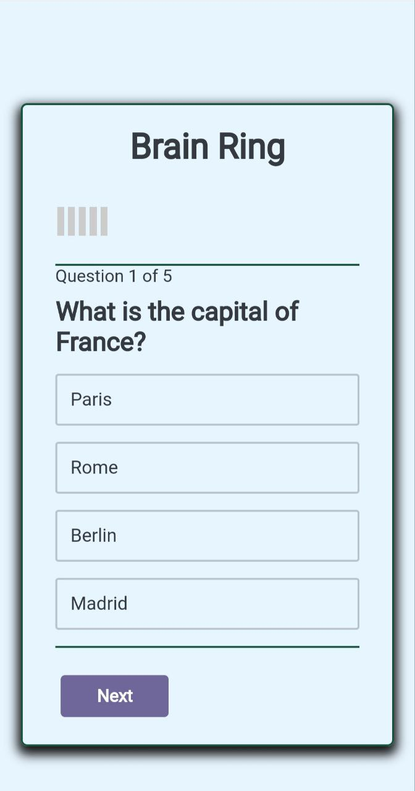

Tablet View:

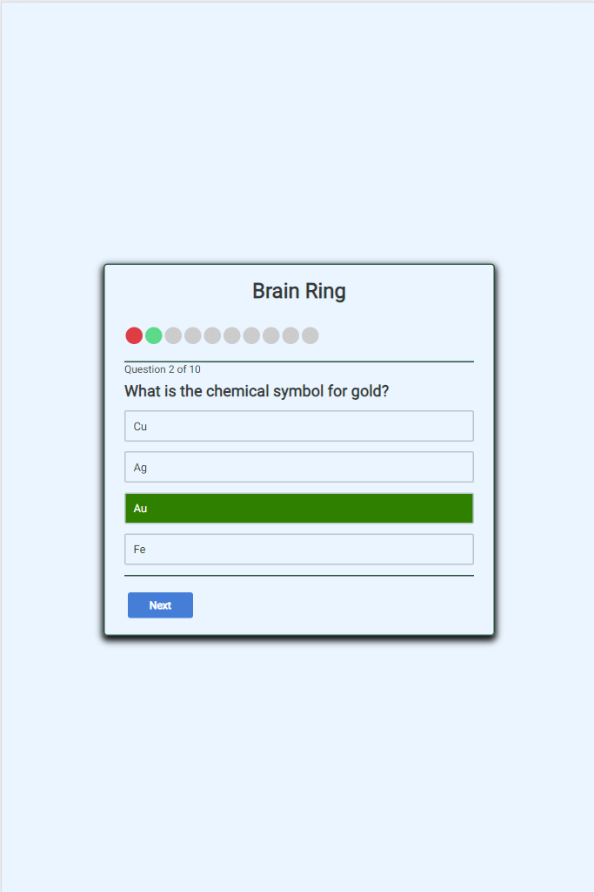

Desktop View:

Alert message:

### Results Page

- Upon completing the quiz, the results page displays the user's performance. A detailed summary includes the user's name, the number of correct answers and overall score.
- Clicking Try Again button a user has a chance of play again the quiz.
- Choosing to press Home button, the user is leaded to the Home page.

 Result page:

### 404 Error page

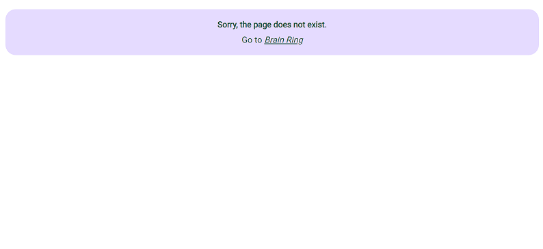

### Features to be Implemented

- **User Highscore:** Introduce a personalized highscore feature for each user, allowing them to track their performance.
- **Choice Timer and Difficulty:** to choose from and difficulty levels, a user could choose a hard level and a short timer, to make it really difficult.

[Back to Top](#table-of-contents)

## Technologies used

### Languages

- [HTML](https://en.wikipedia.org/wiki/HTML "HTML")
- [CSS](https://en.wikipedia.org/wiki/CSS "CSS")
- [Javascript](https://en.wikipedia.org/wiki/JavaScript "Javascript")

### Libraries & Frameworks

- [Google Fonts](https://fonts.google.com/ "Google Fonts")
- [Font Awesome library](https://fontawesome.com/ "Font Awesome")
- [Canva](https://canva.com/ "Canva")

### Tools

- [Balsamic](https://balsamiq.com/wireframes/ "Balsamic") - to create wireframes
- [W3C HTML Validation Service](https://validator.w3.org/ "W3C HTML")
- [W3C CSS Validation Service](https://jigsaw.w3.org/css-validator/ "W3C CSS")
- [jshint](https://jshint.com/ "jshint")
- [Gitpod](https://www.gitpod.io/#get-started) - used to deploy the website.
- [Github](https://github.com/) - used to host and edit the website.

[Back to Top](#table-of-contents)

## Testing
- The game website accomplishes its objectives with a user-friendly design that is responsive to different screen sizes. The interface is clean, the users can enter their username, and enjoy a smooth gaming experience.

### Functionality Tests

| Test Case | Description | Expected Result |
|-----------|-------------|-----------------|
| 1         | Start the quiz with a valid username. | Game starts, and the first question is displayed. |
| 2         | Start the quiz with an empty username. | Alert message displays: "Please enter a username." |
| 3         | Answer a question correctly. | Correct answer highlighted, and the next question is displayed. |
| 4         | Answer a question incorrectly. | Incorrect answer highlighted, correct answer highlighted, and the next question is displayed. |
| 5         | Click the next button skipping to choose any option. |Alert message displays: "Please select an anwer before moving to the next question."  |
| 6         | Complete the quiz. | Final score message displays with the table of results. |
| 7         | Click on the "Try Again" button after completing the quiz. | Game restarts, and the first question is displayed. |
| 8         | Click on the "Home" button after completing the quiz. | The home page is displayed. |

### Responsive Design Tests

| Test Case | Description | Expected Result |
|-----------|-------------|-----------------|
| 1         | iPhone X | Game displays correctly with a user-friendly layout |
| 3         | Samsung Galaxy A13 | Game displays correctly with a user-friendly layout |
| 4         | Lenovo Tab P12 | Game displays correctly with a user-friendly layout |
| 5         | LG Desktop 27'' | Game displays correctly with a user-friendly layout |

### Performance Tests

| Test Case | Description | Expected Result |
|-----------|-------------|-----------------|
| 1         | Use Google Lighthouse for performance testing. | High performance scores for mobile and desktop versions. |

- The final project was tested using Google's Lighthouse on github pages. The results are below

- Performance test for Mobile:

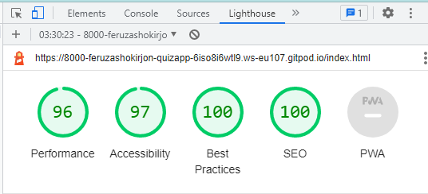

- Performance test for Desktop:

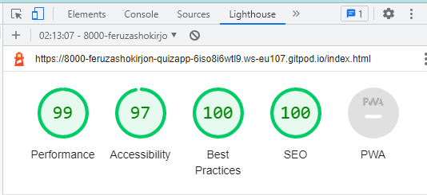

### General Tests

| Test Case | Description | Expected Result |
|-----------|-------------|-----------------|
| 1         | Click on the "Rules" button. | How to play section toggles visibility. |
| 2         | Click on the "Exit" button in Rules. | How to play section disappears. |
| 3         | Skip the question without selecting an answer. | An alert message displays to ask the user to choose an option. |
| 4         | Reset the game after completing it. | Game resets, and the start page is displayed. |
| 5         | Click on the "Home" button after completing the game. | The home page is displayed. |
| 6         | Test the game on various browsers. | Game functions correctly on major web browsers. |

### Validation tests

- HTML, CSS and JavaScript codes where all tested jigsaw.w3.org / validator.w3.org / jshint.com
- JShint was used to test the the JavaScript code, there was 1 undefined variable for question which is in questions.js folder, there were a number of warnings for 'const' is available in ES6 (use 'esversion: 6') or Mozilla JS extensions (use moz). The warnings are be removed by include a commented out line at the top of the file /*jshint esversion: 6 */. Also, there were two unused variable warnings, the reason for that is these variables are being called from HTML. 

HTML Validation Image:

Css Validation Image:

Javascript Validation Image

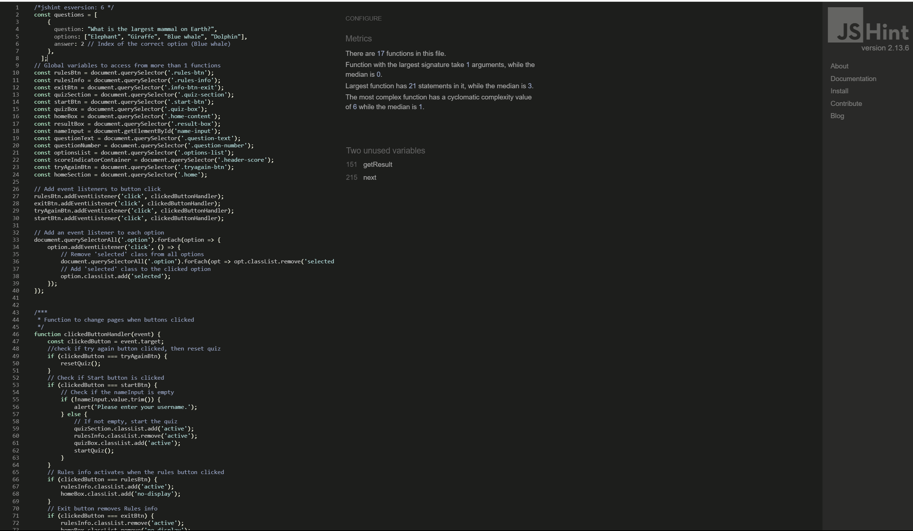

## Bugs

## Fixed Bugs

* During validation these bugs became known during the validation stage, a brief description is below:

These are easily fixed by removing slash.

This was an oversight from the development phase when the font size was being modified. It was easily fixed by setting the background color as planned.

* During manual testing, it was known that, the user is able to submit the quiz empty without selecting any answers. This is fixed by adding javascript code which unables the user skip the question empty.

* There was lots of vertical scrolling on mobile screens due to the large white container underneath the game. This responsiveness issue is fixed by wrapping all sections with div container.

* There was "Home" link in header, which served as navigation link to the home page. It was changed a Home button on results page as it was making navigation difficult.

## Unfixed Bugs

There are no unfixed bugs.

[Back to Top](#table-of-contents)

## Deployment

The site was deployed to GitHub pages. The steps to deploy are as follows:

- In the GitHub repository, navigate to the Settings tab
- From the source section drop-down menu, select the Main Branch
- Once the main branch has been selected, the page will be automatically refreshed with a detailed ribbon display to indicate the successful deployment.
  
The live link can be found here - <https://feruzashokirjonovna.github.io/quiz-app/>.

### Cloning

Cloning the repository will allow to download a local version of the repository to be worked on. 

- Find the relevant GitHub repository.
- Press the arrow on the Code button.
- Copy the link that is shown in the drop-down.
- Now open whatever editor for use & select the directory location where needed the clone created.
- In the terminal type 'git clone' & then paste the link copied in GitHub.
- Press enter and the local clone will be created.

[Back to Top](#table-of-contents)

### Credits

- Idea, content and text are developed by myself.
- Questions are written by myself.

#### Code

- CSS:
- Start and Rules "pressed" Button styles are customized from [W3schools](https://www.w3schools.com/css/css3_buttons.asp).
- Quiz Box shadow is Customized from [html-css-js](https://html-css-js.com/css/generator/box-shadow/).
- To remove scrolling on mobile screens [Stack Overflow](https://stackoverflow.com/questions/58964299/why-is-the-vertical-scroll-getting-stuck-in-mobile-view*/)

- Javascript:
- Inspired by Love Math Project.
- Inspired by [You Tube Tutorial](https://youtu.be/LJ4PZ8JnRCg?si=WmTnFSNYpJCSLI95).
- For making questions and options given randomly [GeeksForGeeks](https://www.geeksforgeeks.org/random-string-generator-using-javascript/).
- To add pointer events to buttons guided John from Tutor Support. 

#### Inspiration and tutorials used from

  - [W3Schools](https://www.w3schools.com/)
  - [Stack overflow](https://stackoverflow.com/)
  - Code Institute Slack Channel

#### Templates and tutorial for creating the readme-file

  - [bezebee - My First Project](https://github.com/bezebee/My-First-Project/blob/main/README.md).
  - [Drupal Wiki](https://www.drupal.org/docs/develop/managing-a-drupalorg-theme-module-or-distribution-project/documenting-your-project/readmemd-template).
  - [GitHub Docs](https://docs.github.com/en).    

## Acknowledgements
The site was completed as a Portfolio 2 Project piece for the Full Stack Software Developer Diploma at the [Code Institute](https://codeinstitute.net/). As such I would like to thank my mentor [Precious Ijege](https://www.linkedin.com/in/precious-ijege-908a00168/), the Slack community, and all at the Code Institute for their help and support. 

Orifjonova Feruza Shokirjonovna 2023.

[Back to Top](#table-of-contents)